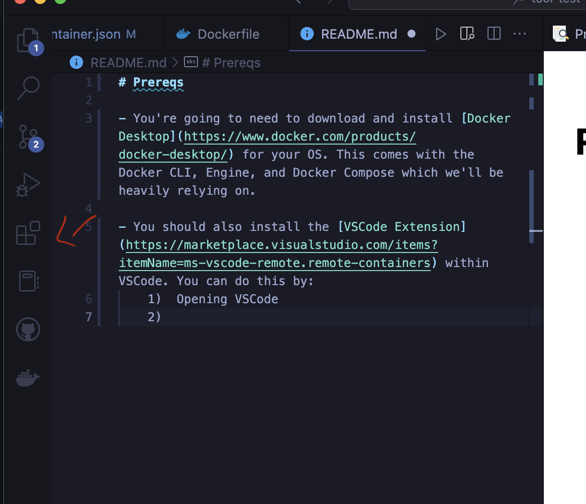
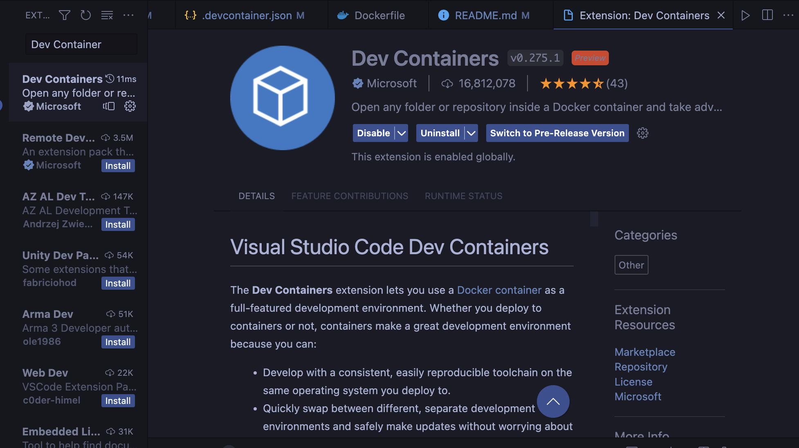
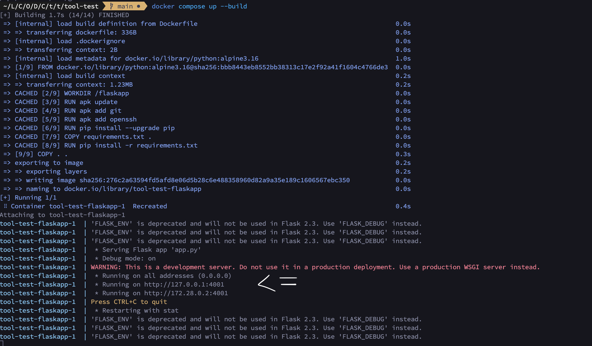
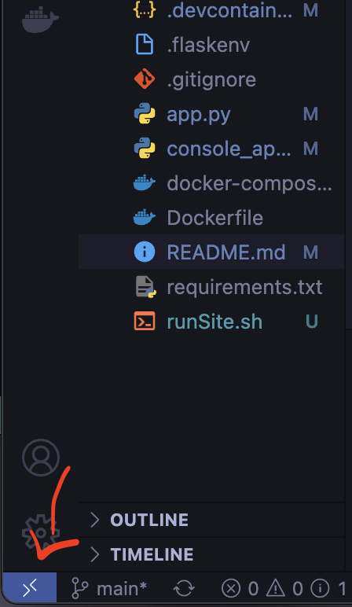
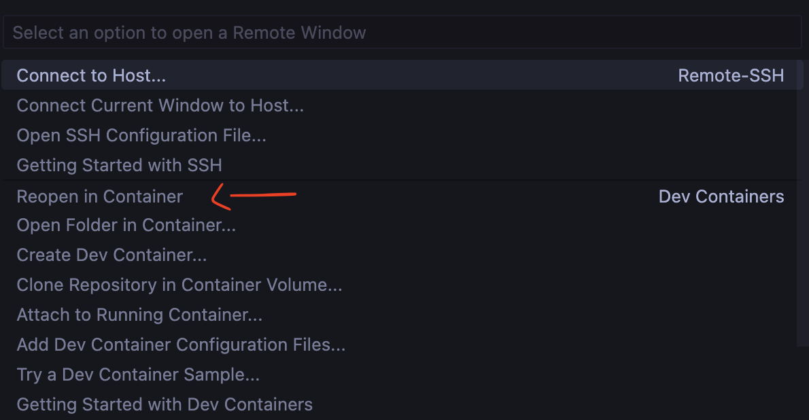
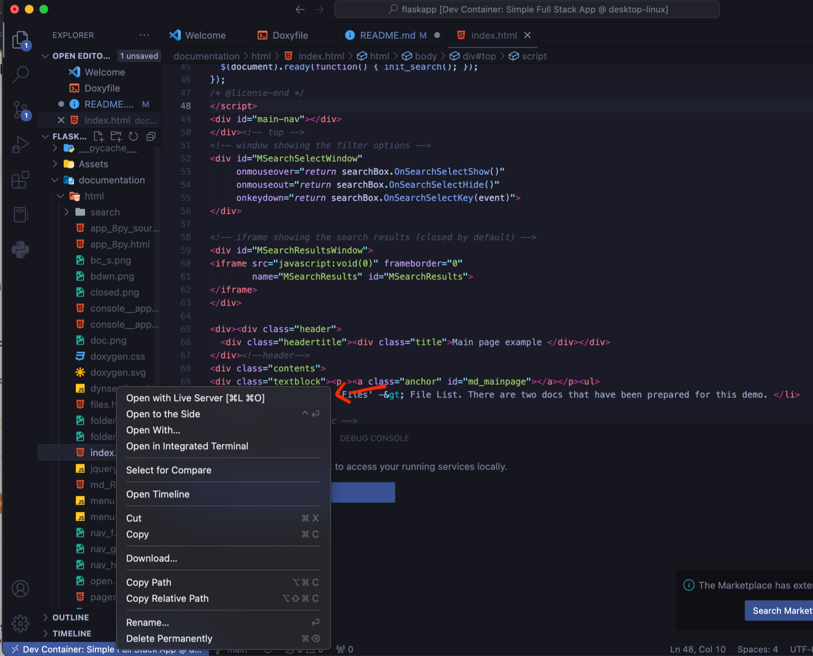

## Docker & DevContainer Demo

A simple demo of the power of DevOps using Docker and Visual Studio Code (VSCode).

** Disclaimer: This demo was originally made for a [specific project](https://github.com/HelloWorldSeniorProject/AirKeys) and may have some inconsistences with current repo, deprecated functionality, or rookie mistakes. Also, the demo's structure is unnecessarily separated; this is not typical and was done this way specifically because it's a demo. Feel free to leave suggestions on how I can make this demo better.

### Table of Contents
1. [Prereqs](#prerequisites)
2. [Docker Basics](#docker-basics)
    * [Demo](#demo)
    * [Pros & Cons](#pros--cons)
    * [The Big Problem](#the-big-problem)
3. [Solution: Dev Containers](#solution-devcontainers)
    * [Using w/ VSCode](#using-with-vscode)
    * [Demo](#demo-1)
    * [Pros & Cons](#pros--cons)

### Prerequisites

1. You're going to need to download and install [Docker Desktop](https://www.docker.com/products/docker-desktop/) for your OS. This comes with the Docker CLI, Engine, and Docker Compose which we'll be heavily relying on.

2. You should also install the [VSCode Extension](https://marketplace.visualstudio.com/items?itemName=ms-vscode-remote.remote-containers) within VSCode. You can do this by:
    1)  Opening VSCode
    2)  Clicking the extensions icon
    
    3) Search Dev Containers. Should look like this.
    
    4) Install
    5) Restart VSCode after installation.
       
3. Clone the repo. 

4. You'll need to reopen VScode in the **docker-devcontainer-demo** folder.

### Docker Basics
**Whenever doing anything with docker, make sure its process is running in the background. Either open the app or check your background processes if you're unsure.** 

The only command you will generally need to run _for this demo_ is `docker compose build` when building the a new image,`docker compose up` to start the image(s), and `docker compose down` when troubleshooting. 
    - Note:  `docker compose up --build` is the shorthand command to both build and start the image(s).

**The next sections will utilize port 4001 & 4002.** This is normally not an issue unless you know you have some other process running on these ports.

#### Demo

To start, open a command terminal the VSCode window and run the command `cd dockerfiles` then, `docker compose up --build` to build and start a new image. This may take a few moments since the image has to build from scratch for the first time. On subsequent runs, the process will be way shorter. Output should look somewhat like this.
    

    - The base image is alpine linux, a very small and portable distribution of linux, with python installed. There are also other applications like git and an SSH client installed for our convenience.
    - At this stage, you should not have any errors. If you do, double check that your Docker Engine and you're running these commands within VScode's terminal. A common error is "no configuration file provided: not found". This means you are not in the dockerfiles directory within the terminal.

Note the section pointed to. Copy and paste this address in any web browser. It should open up a page created using Flask, a Python Web Framework.
    - You can also access this page by going to [localhost:4001](http://localhost:4001)

#### Pros & Cons

Pros: 
    1. One and done approach. Setup once and continue to use.
    2. Combine multiple different images to compose one app. For instance, you can have a image with nodejs (Frontend/Backend) + an image with mongodb (Database) running at the same time to form an entire application.
    3. Portable. Share the dockerfiles and run them. That's it.
    4. Widely supported by other DevOps tools... more on this later.

Cons: 
    1. Only helps when it comes to executing the program. Actual coding and troubleshooting don't get better from the inclusion of docker.
    2. Simple setup but terrible documentation :smiley:.

#### The Big Problem.

You might have noticed that this only help when it comes to program execution. You don't have to have Python or Flask installed on your local machine but for regular coding scenarios like modifying source, interactive testing, repo pushing, and debugging, docker by itself doesn't offer too much help.

### Solution: Devcontainers

Dev Containers are almost exactly like you're regular setup but exist as a virtual environment. This means they can be customized and then used as a template for others' use.

#### Using with VSCode

In the bottom right hand corner of your VSCode window you should see a new icon.

    1. Click it.
    2. A menu of options will pop up. Click *"Reopen in Container"*. Your options may look different depending on your other installed extensions.  
    - **Make sure your VSCode is open in the folder containing the source code (docker-devcontainer-demo). If you're unsure or seeing errors reopen VSCode in the _'docker-devcontainer-demo'_ folder**
    - You should also see a prompt that asks you if you'd like to reopen the folder in the dev container if you're in the correct folder.

This may take a moment to load as the container has to read and execute all the instructions for building the image + setup.
    - Note the console output. Though the startup script itself doesn't do much, however, the ability to run a script on container startup is **really helpful**. Take a look around, see how similar the environment is to what you regularly use. If not, edit the dockerfile to install new packages, shells, compilers, etc... .

#### Demo

Try these out in the terminal to explore the capabilities (_Note: these can be ran independently of one another_):
    * Run `cd ~/flaskapp`, then `scripts/runSite.sh`. This should start the site yet again at [localhost:4002](http://localhost:4002). Note: [localhost:4001](http://localhost:4001) is running the same site because I was too lazy to find a workaround. _`Control + C` to exit_.
    * Run `python` to use the interactive cli. Useful for quick testing. _`exit()` or `Control+D` to exit_.
    * Run `python pythonfiles/console_app.py` to run a more tradition command line program.
    * Run `scripts/runDoxygen.sh`. This will update the 'documentation' folder. Open documentation/html then, find and **open** 'index.html'. Right-Click on it then select "Open with Live Server".
    

#### Pros & Cons

Pros: 
    1. Extensions, packages, language compilers, coding helpers, etc... An entire environment can be setup to develop, test, and execute code. 
    2. OS and other system differences are also minimized because all members will be using linux.
    3. Minimal setup required past original dockerfiles.
    4. Setup once, and use forever. No real maintenance required.

Cons: 
    1. May require one-time setup troubleshooting, especially when it comes to git configuration. 
        - Helpful commands: `ssh-add {ssh_id filename}` on UNIX
    2. Does not have as much out-of-the-box support as Docker with other tools. For example, see the [opened issues](https://github.com/devcontainers/ci/issues) with the official Devcontainer CI action for Github Actions.

Thanks,

\- Kay
